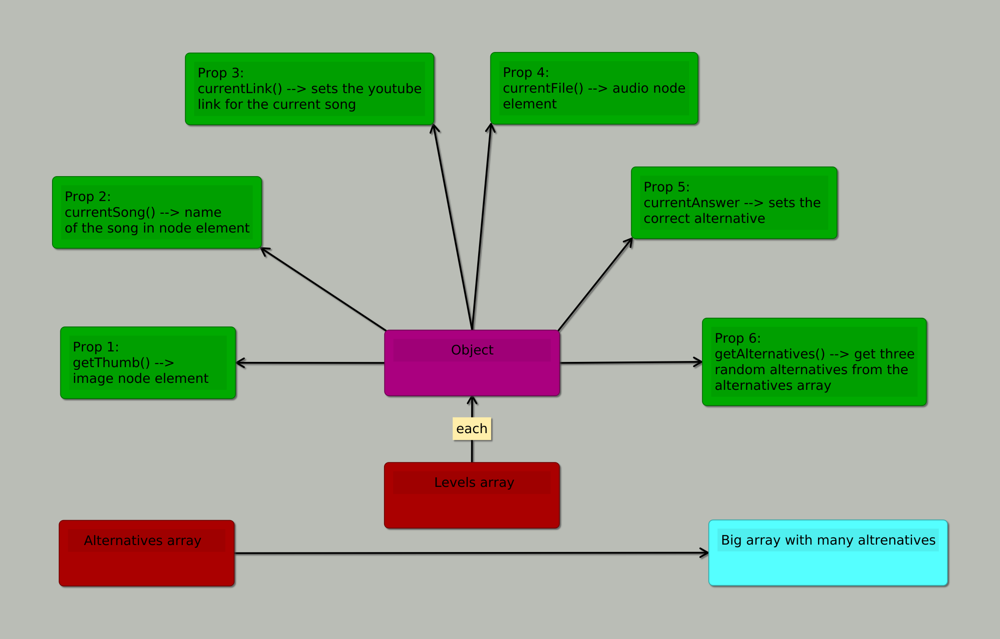
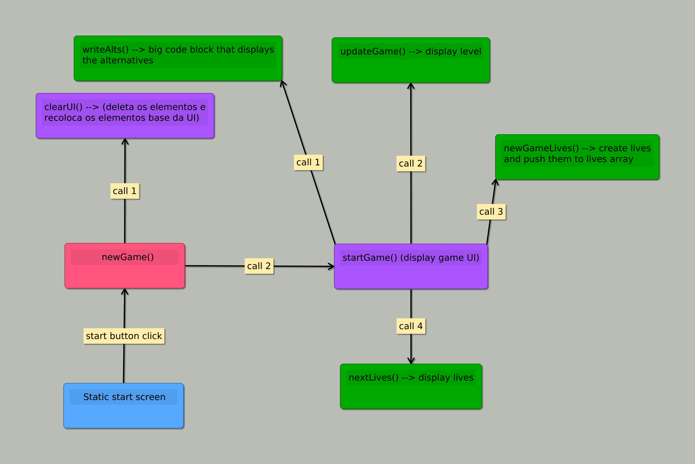

# Development and Process

Here I will detail how I structured the game, the considerations around it
and how everything works.

## Interface

If you've seen the UI layout on the README, here is a mindmap detailing
how it is structured, although since the first prototypes, all the elements
were moved into DOM manipulation inside JavaScript, leaving the HTML as a
template.

## Data Structure

I made a (questionable) choice to make a data structure that stores the node elements
directly inside the properties of an object, mostly because I predicted that it would take many more
lines of code to manipulate raw data inside the properties intro node elements and add them to the
document. The result is a big array with objects that gets manipulated.

## Start Sequence and level progression

As I previously stated, the levels are stored inside an array with objects that gets manipulated. As the player
advances levels, the completed or missed level gets removed from the array, so it won't be selected again. Well
then, how come there is a play again button if the data is gone? There is a function that stores the full array, 
so when the game is won or lost, the function "resets" the array, bringing back the levels. This unfortunate decision
was made because of the previous, questionable decision. By not having raw data inside the properties, manipulating the
objects mutated the properties because they store a function call, so re-setting the array ensured identical node elements.

## Lifes

## Score

## Considerations

Because I went for a more functional approach, I tried to keep each part of the game
separate and independent, so at each user interaction there is one function that calls
every other part, but there is no function rabbit hole (function invoking function invoking function and so on), 
so debugging was a little easier, because bugs are always part-specific, although on the other side of the coin, 
more attention was required as things would work without necessarily being right.