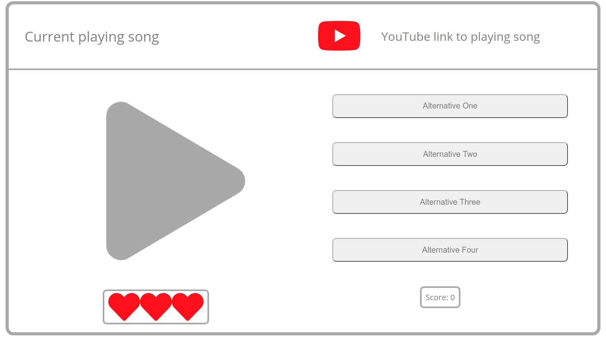

# Guess Who Sampled Game

Welcome to GWS game!
This game is inspired by modern music production techniques. In it, you have a
track that was made using a sample from another song, and your job is to
guess from which song the sample used inside the track came from!

The rules are simple:

You have 3 lives, and to win you must go through all levels without losing all your lives.

On the top, the level's track will be displayed, and if you want to, the YouTube
link by your right will take you to YouTube so you can listen to the full track.

You can listen to the sample as many times as you want, but you have only one chance at each
level, and each mistake consumes a life.

On the left, you have the play button and your lives right below, so keep track of them!

On the right, you have all the 4 alternatives to select from, so you can always use
smart-pants tech and eliminate those less likely to be the answer on your mind.

## Interface

Here you can see the interface and what each part does.
On the right you have the name of the song that's playing,
the play button, and your lifes. On the left you have the link to the full song, 
the possible answers and your current score. When you click an answer, 
it will turn either green or red, and you'll shortly advance levels.

## Documentation

For more technical documentation go [here](DevelopmentProcess.md)

## Special Thanks to

- My teachers and TAs from Ironhack involved in my learning experience that helped me get this far
- Jussi Lind for developing [Heimer](https://github.com/juzzlin/Heimer), the Open Source mindmap tool I used to make all
the mindmaps for the docs

### Footer

Game project developed during the Ironhack WDPT course as
the first module project.
